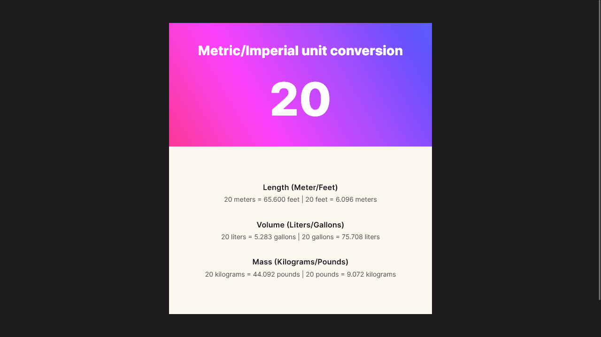

# Scrimba - unit-converter solution

This is a solution to the [Unit-converter challenge on Scrimba](https://scrimba.com/learn/learnjavascript/). Scrimba challenges help you improve your coding skills by building realistic projects.

## Table of contents

- [Overview](#overview)
  - [The challenge](#the-challenge)
  - [Screenshot](#screenshot)
  - [Links](#links)
- [My process](#my-process)
  - [Built with](#built-with)
  - [What I learned](#what-i-learned)
  - [Continued development](#continued-development)
- [Author](#author)

## Overview

### The challenge

Users should be able to:

- Converts length, volume and mass units changing the input via Javascript file

### Screenshot



### Links

- Solution URL: [@GitHub](https://github.com/xdelmo/unit-converter)
- Live Site URL: [@GitHub](https://htmlpreview.github.io/?https://github.com/xdelmo/unit-converter/blob/master/index.html)

## My process

### Built with

- Semantic HTML5 markup
- CSS custom properties
- Flexbox
- Mobile-first workflow
- Vanilla Javascript

### What I learned

In this solo project I learnt how Javascript deals with strings and numbers to modify the HTML text.
As [Per Harald Borgen](https://github.com/perborgen) said: "Strings always win against numbers" 🥇

```js
// modify paragraph with updated conversions
lengthConversion.textContent =
  input +
  " meters = " +
  resultMetersToFeet +
  " feet | " +
  input +
  " feet = " +
  resultFeetToMeters +
  " meters ";
```

### Continued development

I'd like to implement a way to choose the number to convert directly in the HTML.

## Author

- Website - [Emanuele Del Monte](https://www.emanueledelmonte.it)
